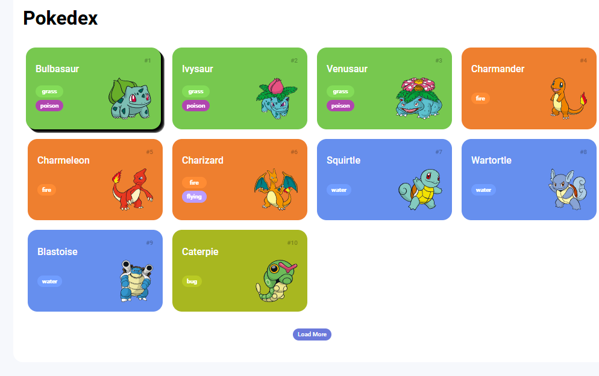
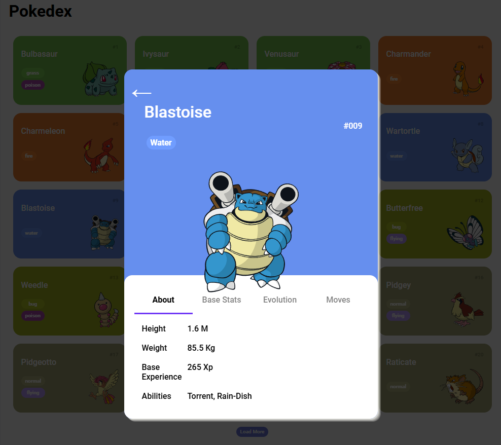
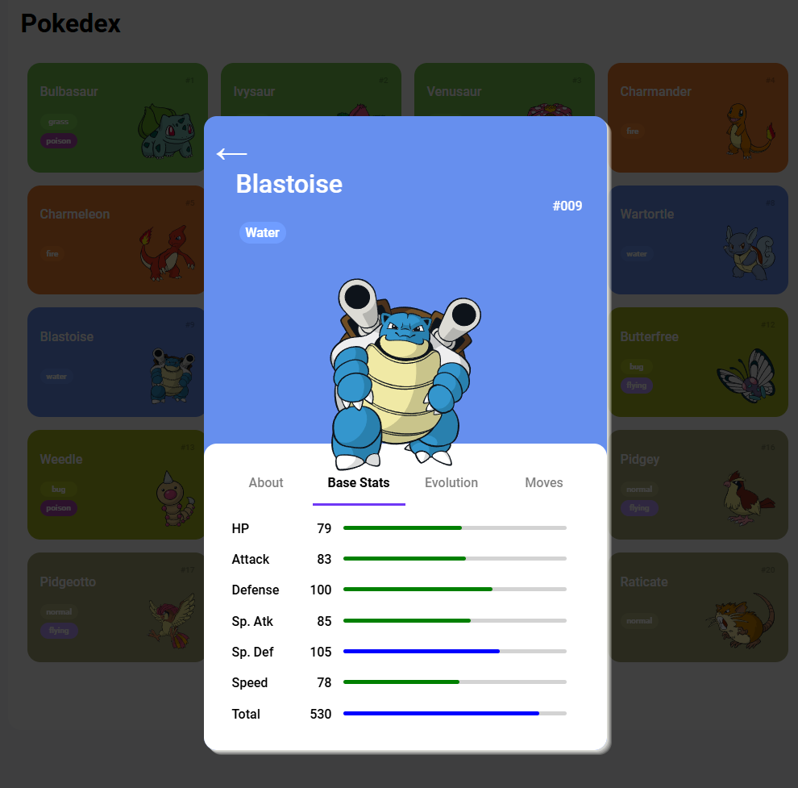
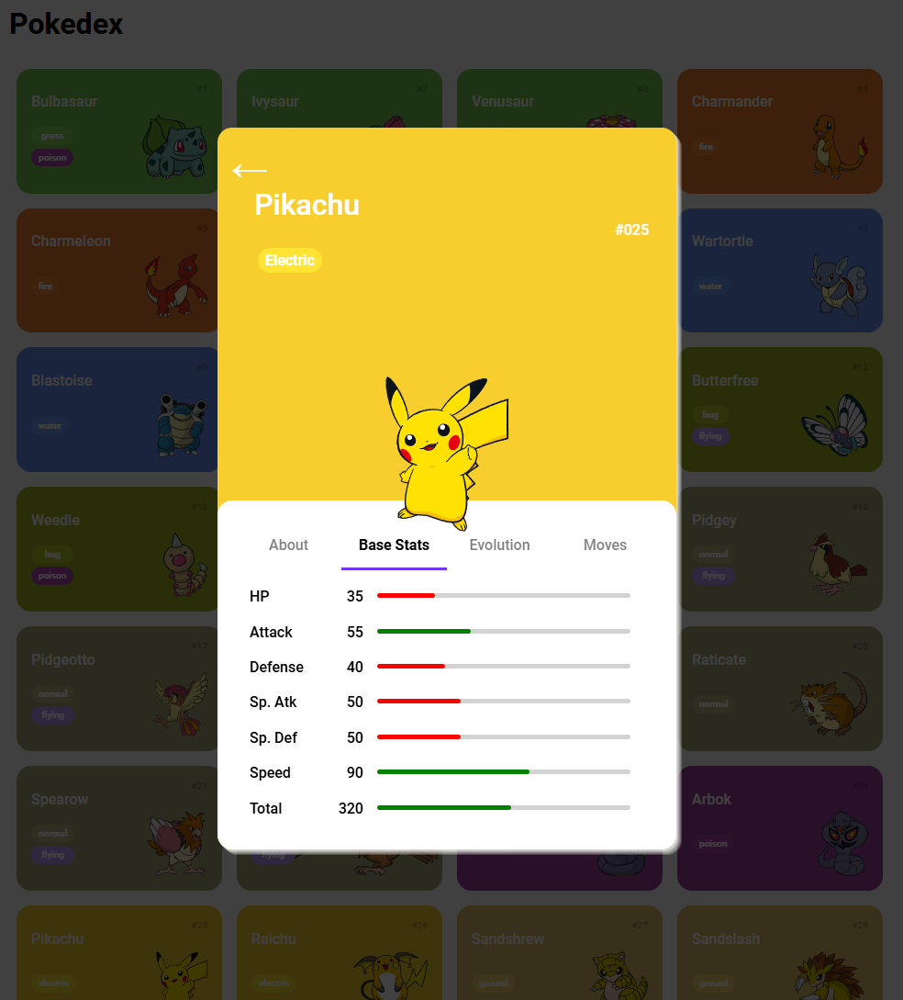

# Trilha JS Developer - Pokedex

Projeto onde exploro todos os conceitos que aprendi neste Desafio de Projeto (Construindo uma Pokédex com JavaScript). Para isso, foi usado como o base o projeto aprendido em aulas do curso.

## Desenvolvimento:

Foi realizado a transformação dos cards em botões, onde clicando-os abre uma janela contendo as informações do Pokemon selecionado.
Nesse janela | card que se abre contem abas, onde selecionando, trazem informações sobre o Pokemon, atributos base e habilidades.

## GitHub (DIO) do projeto base:

[JS DEveloper Pokedex](https://github.com/digitalinnovationone/js-developer-pokedex)
